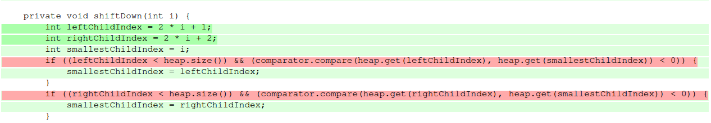

# Implementing and testing a binary heap

A [*binary heap*](https://en.wikipedia.org/wiki/Binary_heap) is a data structure that contains comparable objects and it is able to efficiently return the lowest element.
This data structure relies on a binary tree to keep the insertion and deletion operations efficient. It is the base of the [*Heapsort* algorithm](https://en.wikipedia.org/wiki/Heapsort).

Implement a `BinaryHeap` class with the following interface:

```java
class BinaryHeap<T> {

    public BinaryHeap(Comparator<T> comparator) { ... }

    public T pop() { ... }

    public T peek() { ... }

    public void push(T element) { ... }

    public int count() { ... }

}
```

A `BinaryHeap` instance is created using a `Comparator` object that represents the ordering criterion between the objects in the heap.
`pop` returns and removes the minimum object in the heap. If the heap is empty it throws a `NotSuchElementException`.
`peek` similar to `pop`, returns the minimum object but it does not remove it from the `BinaryHeap`.
`push` adds an element to the `BinaryHeap`.
`count` returns the number of elements in the `BinaryHeap`.

Design and implement a test suite for this `BinaryHeap` class.
Feel free to add any extra method you may need.

Use the following steps to design the test suite:

1. With the help of *Input Space Partitioning* design a set of initial test inputs for each method. Write below the characteristics and blocks you identified for each method. Specify which characteristics are common to more than one method.
2. Evaluate the statement coverage of the test cases designed in the previous step. If needed, add new test cases to increase the coverage. Describe below what you did in this step.
3. If you have in your code any predicate that uses more than two boolean operators check if the test cases written to far satisfy *Base Choice Coverage*. If needed add new test cases. Describe below how you evaluated the logic coverage and the new test cases you added.
4. Use PIT to evaluate the test suite you have so far. Describe below the mutation score and the live mutants. Add new test cases or refactor the existing ones to achieve a high mutation score.

Use the project in [tp3-heap](../code/tp3-heap) to complete this exercise.

## Answer

You can find the program code [here](../code/tp3-heap)
##### Qst 1
In this program, I implemented the heap sort using binary heap data structure (Min Heap).

For pop, push, count tests, checking the number of elements (Size of the heap) in the heap is a **common** characteristic
between these tests to verify the correct functioning.

For our tests, we chose the Integer object, and then defined input blocks for our tests.

As you will see in the tests, there are mainly 3 global blocks for most of the tests:

- The case where the heap is empty (in this case, we tested the count and also the exceptions for the peek and pop methods).
- A case where we insert a null value (also a test for exception handling).
- For the pop / peek / push methods, the idea was to test both the size and the order of the elements in the heap after a push or pop, 
based on different test cases (with a single element, multiple elements, and duplicate elements).

#### Qst 2 and 3
After defining the tests and test cases, we achieved a coverage of 96%. 
The remaining uncovered code was due to the **shiftUp(i)** method, which had a missing branch. 
To address this issue, we added a small additional test with a negative number, and we also changed the visibility of this method so that we could test it.

If you look at the code of the function, there is no **else** statement, which is why we added this test => `assertDoesNotThrow(() -> binaryHeap.shiftUp(-1))`.

##### Qst 4
In the PIT test, we achieved a score of 94%. As you can see in the screenshot below, there are two living mutations of type 'conditional boundary'. We were able to eliminate the second one by adding another test case. However, we could not eliminate the first mutation because it is related to the logic of our algorithm. Since we accept duplicated values, changing '<' to '<=' does not affect the program, and we get the same results. That is why we did not add test cases or refactor to eliminate this mutation.


#### Utils
To get the coverage report , follow this steps :
- `mvn test`
- `mvn jacoco:report`

For the PIT report, you can use the command: 
- `mvn clean test pitest:mutationCoverage`.

You will find the generated reports in **target/pit-reports**


